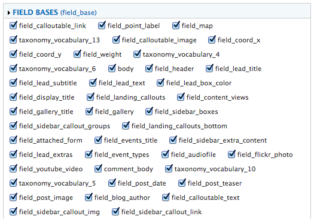

Drupal has a [Features module](https://drupal.org/project/features) which allows for certain configuration settings (Views/Context/Content Types) to be exported to code. This way you can separate out configuration from content, and avoid having to sync databases up/down environments.

Except that sometimes (in my experience) you hit a wall with a created feature. I’m not sure where that limit is, but sometimes you end up with a feature that simply won’t allow you to re-create it cleanly.

In those cases my workaround has been to simply export just the specific component that changed, and then hand-merge the code myself. This can be troublesome if you have a *lot* of components, however.

 

So here’s a quick line of jQuery you can run in your browser console to uncheck every component in your features module.

```js
jQuery(".component-included.form-checkbox").removeAttr('checked');

```

I’ve also put this up as a [gist](https://gist.github.com/dirtystylus/6295769).
