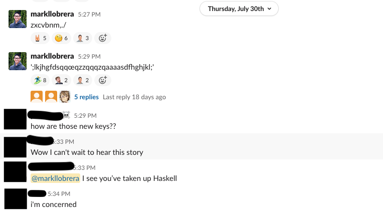

I’ve been re-organizing my desk layout since the Covid crisis pushed my office to full-time remote work. One of the priorities was to get a smaller keyboard so that I could use both a keyboard and mouse in my desk’s slide-out keyboard tray. That tray is only about 18" wide x 16" deep, however — even a tenkeyless model wouldn’t leave me enough room for a mouse.

Enter the [Drop ALT](https://drop.com/buy/drop-alt-mechanical-keyboard): a compact (67-key) keyboard. It’s got a hot-swappable switch plate, RGB lighting for the keys and around the plate, and is programmable via Drop.com’s web interface (as well as QMK, but I haven’t tried that yet). [9to5 Toys](https://9to5toys.com/2020/02/21/drop-alt-keyboard-review-clean-well-built-and-customizable-video/) has a review covering most of the features. I put in my order a few months ago and didn’t expect it until the end of August, but it arrived early so I’ve had time to configure mine to my liking.

{data-responsiver=cinemascope}

I ordered it with [Halo Clear](https://input.club/the-comparative-guide-to-mechanical-switches/tactile/halo-clear/) switches: these are tactile switches, but stiffer than the  Cherry MX Browns on my [12-year-old Filco](http://dirtystylus.com/2008/05/16/filco-majestouch/). After using them for just over a week my RSI flared up, though — they’re just too stiff for my hands, and I’m not even a heavy typist who likes to bottom out on my keys. Since I don’t have to worry as much about noise, I decided to try out a clicky switch — I picked [Kailh Box Whites](https://kbdfans.com/products/kaihua-box-switch-blue) (MX Blues look like a comparable switch, as well). The Halo Clears are off to my friend Max for him to try out on one of his ever-growing collection of boards.

The default keycaps that ship with the ALT are…ok. They’re shine-through, but I wouldn’t be surprised if most folks who buy an ALT for the flexibility in switches and layout programming end up switching out the keycaps as well. I wanted a bit of color so I picked up this [SA Chalk set from KBDFans](https://kbdfans.com/collections/sa-profile/products/pbt-sa-chalk-keycaps-set). (If you’re interested in the different keycap profiles [this post has a good diagram](https://switchandclick.com/2020/04/23/ultimate-guide-to-picking-a-keycap-set-for-your-mechanical-keyboard/).) The SA Chalk ones are not shine-through, but I tend to have backlighting turned off so that’s not a big deal to me (I did show my younger daughter how to cycle through the backlighting options, though, and whenever she stops by my desk she turns it back on).

Changing up the switches and keycaps took about an hour. Drop includes keycap and switch pullers, although be careful with the switch puller — it’s metal and can scratch the finish on the aluminum baseplate. I also suggest that you test the switches *before* you put the keycaps back on — the switch connectors are pretty fragile and can get easily bent when you’re snapping them into the board — I had to fix and re-mount about four switches, and I found one defective switch that activated at the slightest pressure.

I also suggest that you *not* test your switches with any communications programs running; I was typing into TextMate with [MacOS’s Keyboard Viewer HUD](https://support.apple.com/lt-lt/guide/mac-help/mchlp1015/mac) layered on top but at some point TextMate crashed and I ended up with Slack in the foreground, alarming my teammates:

I had to do some [key remapping](https://drop.com/talk/10343/how-to-configure-your-alt-keyboard) — I use the tilde (~/\`) key quite a bit to toggle windows within programs, so I shifted the ESC key to the bottom row, right of the spacebar. I also changed up the right-most row of keys because I wanted the key profile to be consistent from row to row.

Overall I think this is a good keyboard if (like me) you haven’t found a go-to switch type, or you just like to mix-and match different switches for different keys, or just just love changing up switches and keycaps regularly. It is quite expensive, though, so if you already have a favorite switch you might be better off with a [Ducky](https://www.nytimes.com/wirecutter/reviews/best-compact-mechanical-keyboards/) or a [pre-built  Tofu/Tada68](https://kbdfans.com/collections/fully-assembled-keyboard).

More photos from the keyboard makeover:

