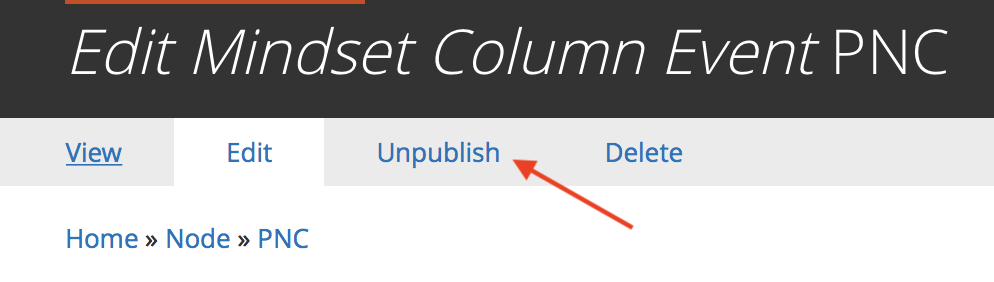

It appears that the default permissions options don’t expose this option, so any non-admin roles will not be able to check/uncheck the “Publish” checkbox on a node.

I tried:

- <https://www.drupal.org/project/publishcontent>
- [https://www.drupal.org/project/override\_node\_options](https://www.drupal.org/project/override_node_options)

Of the two, Override Node Options was a better fit — it exposed permissions for publish/unpublish transparently, whereas the Publish Content module added tabs for Publish/Unpublish, which is not where most content authors would expect to find those options.

