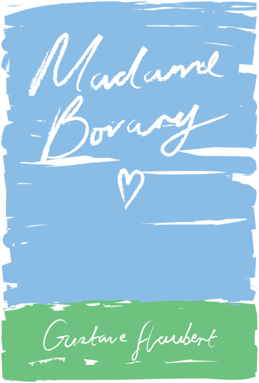

[A recent post by Robin Rendle](https://robinrendle.com/notes/we-long-to-move-the-stars-to-pity/) referenced a passage from *Madame Bovary*, which I have never read.[^1] That reminded me of a design project to give classic literature new covers, sending me into a bit of a [Pinboard](https://pinboard.in) rabbit hole. A quick search of my bookmarks turned up nothing, but a DuckDuckGo search led me to [Recovering the Classics](http://recoveringtheclassics.com).[^2] I wasn’t too pleased with the Project Gutenberg version of the book, so I paid for the [RtC ePub version](https://creativeaction.network/products/madame-bovary-ebook-by-alex-morris) which in addition to a unique cover also came with new formatting. As a bonus the site takes Apple Pay.[^3]

[^1]: I’ve had a mental note to read it for a while, after a conversation with a former colleague where they talked about how our appreciation of books is colored by the season of life we’re in when we read them.

[^2]: It turns out I did have it bookmarked, from way back in 2014. But I didn’t have it tagged, which made the bookmark useless. This is a frequent occurrence in my life.

[^3]: In the last year I’ve probably encountered Apple Pay on the web a total of three times.
