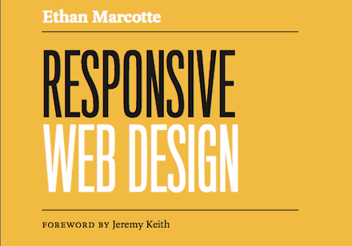

A Book Apart just released volume 4 in its ongoing series of books, [*Responsive Web Design* by Ethan Marcotte](http://www.abookapart.com/products/responsive-web-design "Responsive Web Design by Ethan Marcotte"). Words like “essential” get tossed around far too easily these days, but this book deserves that and every other accolade it’s racked up. So instead of trying to pile on with the superlatives I’ll put it this way: this is the book I’ve needed for the last few months, but not exactly for the reasons I expected.

I’d read the [original Responsive Web Design article](http://www.alistapart.com/articles/responsive-web-design/, "Responsive Web Design") and heard Ethan speak at [An Event Apart Boston](http://aneventapart.com/2011/boston/ "An Event Apart Boston"), so I’d already cobbled together an ad-hoc workflow based on what I gleaned from those sources. Still, there were gaps. I felt like I had been given the pieces of a very powerful machine (or robot!), but with only a napkin sketch on how to assemble it.

So I was looking to this book to fill in those gaps, and it does that. It explains each of the components of responsive web design—fluid grids, flexible images, media queries—and shows how to combine them into a design and development workflow. More importantly, however, it places them in the context of a much larger discussion about how best to serve users. That is what truly impresses me about what Ethan has done with this book: he’s articulated part of the *why* in addition to the *how*. And frankly, that’s the more important question, because it’s the one we should be asking ourselves at the outset. He writes:

> The long and short of it is that we’re designing for more devices, more input types, more *resolutions* than ever before. The web has moved beyond the desktop, and it’s not turning back.

Those are words that are simultaneously scary and exciting: we have a bigger challenge, but we also have a huge opportunity to affect the course of the open web. Before I read this book, I had thought of responsive web design as primarily being a solution for challenges specific to “mobile” users: “how do I get this big site to look good on little screens?”. The bulk of the book does just that, taking a website originally designed with a large (desktop) screen in mind, and applying responsive design techniques to present that same content in a smaller screen. In the final chapter, however, Ethan flips this order on its head:

> Speaking broadly, responsive design is about starting from a *reference* resolution, and using media queries to adapt it to other contexts. A more responsible approach to responsive design would mean building our stylesheet with “mobile first” in mind, rather than defaulting to a desktop layout. So we’d begin by defining a layout appropriate to smaller screens, and then use media queries to progressively enhance our design as the resolution increases.

That single paragraph really made me stop and think, because when used as a mere solution to layout problems, responsive web design can still ultimately fail the user. Ethan goes on to describe the way his personal site [ethanmarcotte.com](http://ethanmarcotte.com) builds from the simple to the complex, and then finally applies that thinking to the [example site](http://responsivewebdesign.com/robot/) used throughout the book. This interpretation of progressive enhancement is nothing new, but to me it’s the crucial part of this book. Without this underlying philosophy of putting the user first and scaling their experience to match their device capabilities, responsive web design can be misused as a decorative parlor trick. It’s when it is employed as a way to solve problems for the user that it becomes absolutely revolutionary. *That* is what profoundly affected me after I put it down, and why I hope this book finds its way into the hands of as many web designers as possible.
