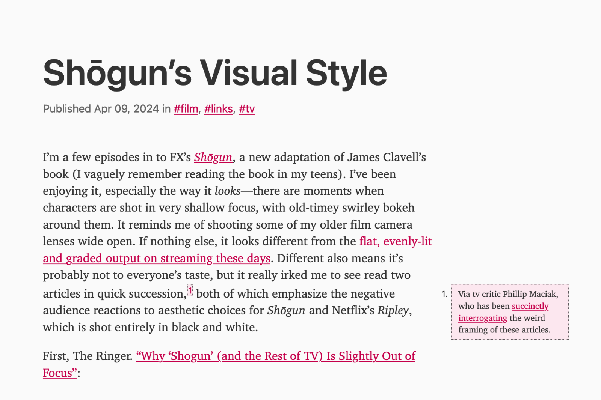

I really liked the way sidenotes were implemented on Molly White’s recent post [“AI isn't useless. But is it worth it?”](https://www.citationneeded.news/ai-isnt-useless/) so I decided to take a crack at porting that code to my site.^[I believe Molly’s site uses [Ghost](https://ghost.org/).]

Looking under the hood of Molly’s site I found a **`sidenotes.js`** file, which I adapted (mostly just changing the CSS classes used for selectors, since my markup is a bit different). The JavaScript does a few things:

* Checks the post for footnotes, and if it finds them *and* there’s enough horizontal space it drops them into the grid column outside the main text column
* Checks for collisions between sidenotes that are stacked close together, which is nice (ty Ghost FE people!)
* Hides the default footnotes

At smaller widths the sidenotes are hidden and the default footnote behavior is restored.

You can view the modified code from my site [here](https://github.com/dirtystylus/eleventy-test/blob/master/js/sidenotes.js).

Here’s what it looks like on a [recent post](/posts/shogun-visual-style/):

{data-responsiver=cinemascope}