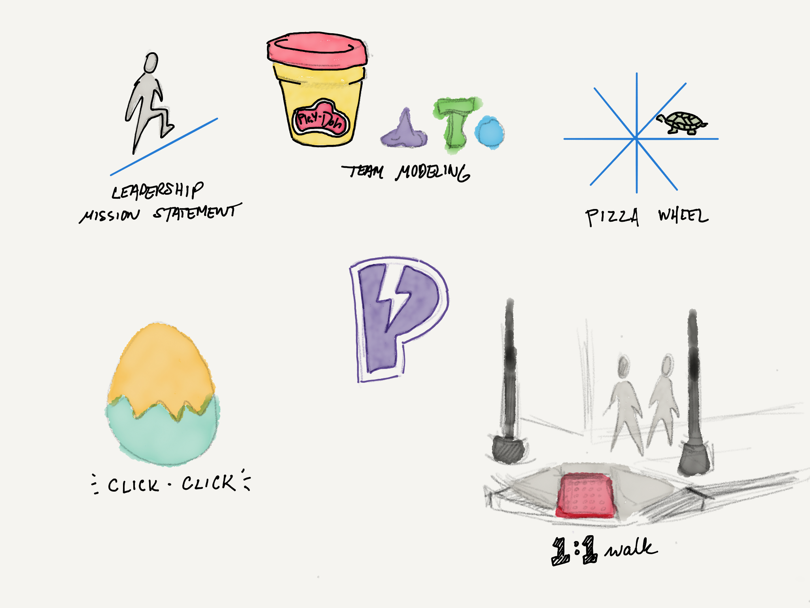

{data-responsiver=cinemascope}

Last week I attended [“So Now You’re a Manager”](https://www.beplucky.com/manager/), a two-day experience/conference organized and led by [Jennifer Dary](https://twitter.com/jenniferdary)[^1]. I’ve been the Technology Director for Bluecadet Philadelphia for the last three years, and most of what I know about managing people I’ve learned on the fly—I’ve never had any formal training beyond a few coaching sessions. I’ve assembled most of my managing skills from lessons absorbed from former mentors (both good and bad), blog posts, Twitter rants, and conversations with some colleagues. So now was as good a time as any to go through some formal curriculum, and get some feedback from my peers.

Even though the fourth nor’easter of this Winter/Spring threatened everyone’s schedules, close to twenty folks gathered at [SEER Interactive’s](http://www.seerinteractive.com) offices for the two days. It was a nice mix of local Philadelphia folks and people from out of town, and it wasn’t all agency/product managers. I give credit to Jennifer for intentionally seeking a balance across industries, regions, and genders.

The two days were filled with a good mix of short lectures, group discussions, and workshop exercises. Jennifer was a great host and facilitator, and I was struck by her ability to listen deeply and invite people to contribute. Our discussions and exercises covered topics like delegation, hiring, managing up (aka managing your boss), and how to organize/do 1:1s with your reports. Some of this stuff wasn’t new to me, and instead served as confirmation that I’m on the right track. Other ideas were new, and I’m contemplating how best to integrate them into my managing style.

Being a manager can often feel like a lonely road, and getting to meet a self-selected group of my peers (many of whom face similar challenges as me) helped defray that loneliness somewhat. Sometimes it’s good just to know that there’s other folks out there who are doing the best they can, every single day. The good souls who were there were very open and vulnerable and generous, and it was a pleasure to be in their company.

If you’re moving from an individual contributor role, the lack of good training and resources can be frustrating — I can highly recommend *SNYAM*. I believe Jennifer has a couple more sessions planned for this year ([the next one is in Oakland, CA in June](https://www.beplucky.com/manager/)), so if this speaks to you start scheming to attend.

[^1]: While chatting after the conference, Jen and I discovered that there is a ton of overlap between her friends and mine, which I find both hilarious and unsurprising.