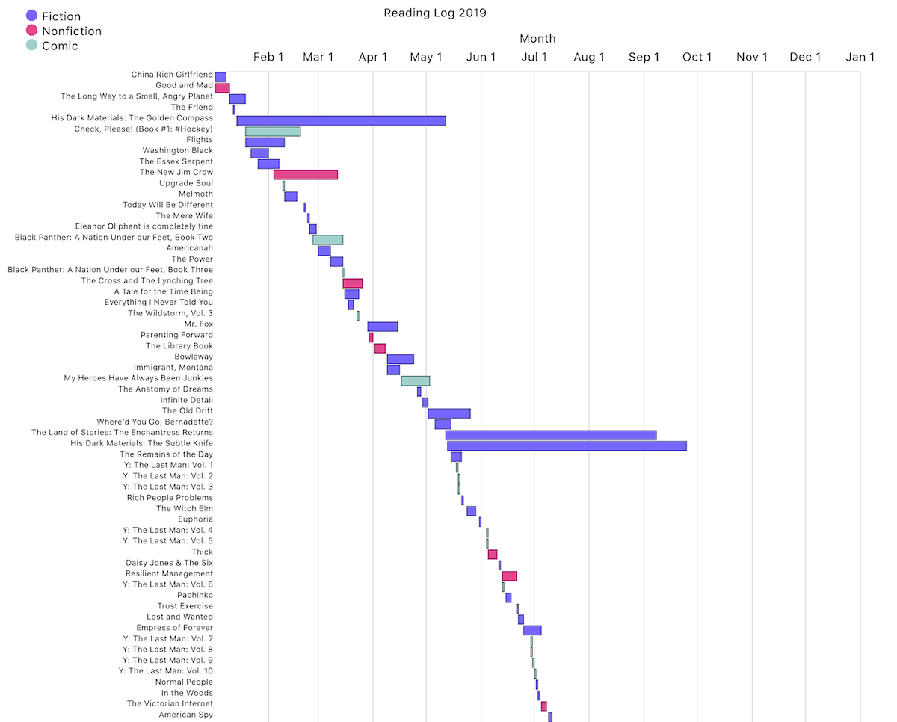
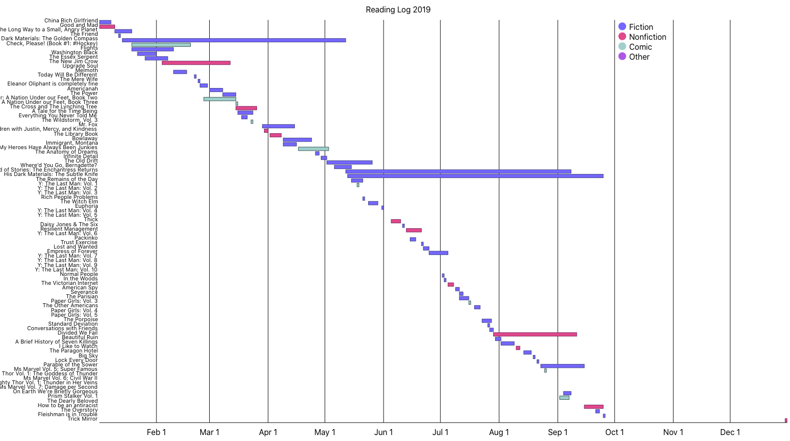
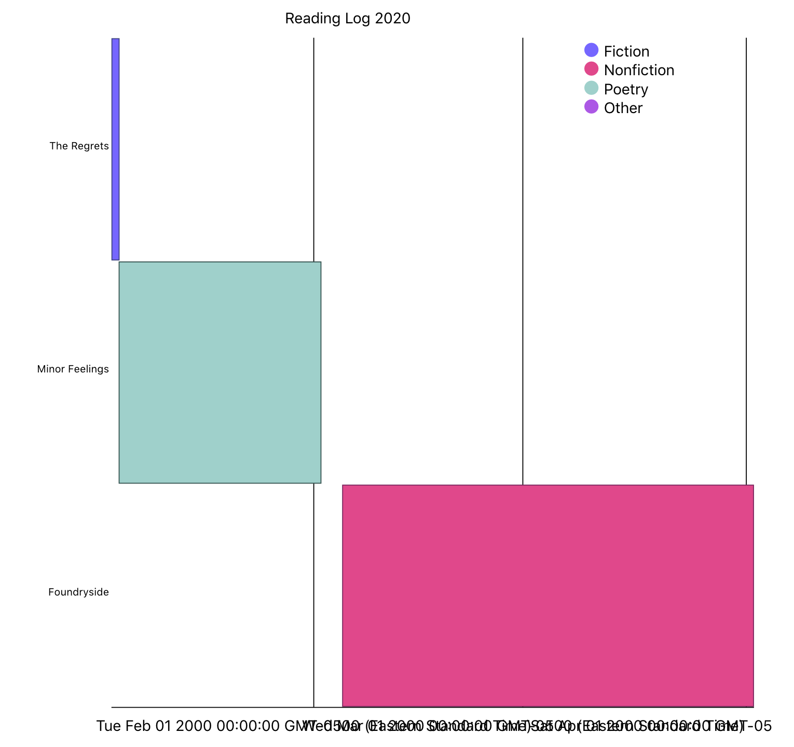

When I [tracked my reading during 2019](http://dirtystylus.com/2020/01/14/reading-log-2019/) I had a loose idea that I might want to do some simple data visualization to look back on the year. Ask any designer or developer and this can quickly devolve into endless [yak shaving](https://en.wiktionary.org/wiki/yak_shaving), and indeed there was a moment where my brain was like, “Clearly I need to learn React Fiber and D3”. Thankfully I stepped away from that larger goal (distraction?) and found [Semiotic](https://semiotic.nteract.io), created by Elijah Meeks. Meeks has [written a lot about dataviz, React, and D3](https://medium.com/@Elijah_Meeks) and together with Amy Cesal and Mollie Pettit cofounded the [Data Visualization Society](https://www.datavisualizationsociety.com).

Semiotic provides a lot of common chart types out of the box, including what I was looking for: [a timeline](https://semiotic.nteract.io/examples/timeline). I used that as a jumping off for my visualization. Here’s the [in-progress result](https://laughing-ritchie-9d0f34.netlify.com/), if you want to skip ahead.

{data-responsiver=cinemascope}

## Dates and Time Scales

The Semiotic Timeline example is handy, but my timeline only stretched across one year. So I had to figure out how to map a different time scale to the chart.

### Adding Month and Day information

I added month/day information as a JavaScript date. Here’s what a book looked like in my first pass at the data set

```json
{
 title: "Conversations with Friends",
 author: "Sally Rooney",
 start: new Date(2019, 6, 27),
 end: new Date(2019, 6, 29),
 genre: "Fiction"
},
```

A few things to note:

* This worked, but if I wanted to externalize my data into a JSON file this would not be valid
* Dealing with dates this way you run into the weirdness of having the month be 0-indexed, but the day isn’t. Which … fine, you just do the math in your head, but it’s annoying

Ultimately this is how I ended up storing the dates:

```json
{
  title: "The Dearly Beloved",
  display_title: "The Dearly Beloved",
  author: "Cara Wall",
  cover_image: "the-dearly-beloved.jpg",
  genre: "Fiction",
  start_date: "2019/9/14 1:00",
  end_date: "2019/9/14 23:00"
},
```

Note the hour information — I don’t do this for all of my entries, just the books that I started and finished on the same day. When I ran the first charts I noticed that the same-day books wouldn’t get rendered at all, so I had these weird gaps in my chart. 

{data-responsiver=cinemascope}

I put out a quick query to the Semiotic Slack channel, and Elijah responded:

> Oh, interesting. So, technically, if it's the same day beginning and end then that would be a zero, so I don't think we'd want to render those. However, you could set the start date with the time equal to 12:01AM and the end date with 11:59PM and that should give you a shape.

I added hours and the gaps went away. While I was fixing that I decided that I should have the data array be valid JSON — which meant that I had to convert the dates before feeding them into the chart, so this is what I do in the `rAccessor` property:

```js
rAccessor: function (e) {
  return [new Date(e.start_date), new Date(e.end_date)];
},
```

### Formatting the X Axis

When I first plugged in my data I put in expanded date information and … yikes. It was clear I needed to deal with axis labels:

{data-responsiver=cinemascope}

A little bit of digging revealed that D3 has some handy things: time scales, and time formats. Since Semiotic is pretty much glueing React and D3 together, it seemed like a good next step to figure out how to get time scales. Dozens of tabs later, this is where I ended up. Semiotic has an `rscaleType` property which can receive a time scale domain, which is the full set of values for the time scale. Here I’m restricting the time scale to a single year:

```js
const timescale = scaleTime().domain([
  new Date(2019, 0, 1),
  new Date(2020, 0, 1)
]);
	
…
	
rScaleType: timescale
```
	

You can also set a timescale format for the tick mark labels, like “Jun 01” 

```js
var timescaleFormat = timeFormat("%b %e");
```

and pass that in to the `axes` property, along with the number of tick marks that we want (in this case 12, one per month):

```js
axes: [
    { orient: "top", ticks: 12, tickFormat: timescaleFormat, label: "Month" }
  ]
```

## Tooltip Annotations

Semiotic has two properties if you want to do tooltip annotations, `pieceHoverAnnotation` and `hoverAnnotation`. Set both to true and you have tooltips that are placed relative to your mouse position.

In my case I also wanted to customize the content that showed up within the tooltip, so I used the `tooltipContent` property which lets you feed in JSX:

```jsx
tooltipContent: (d) => (
  <div className="tooltip-content">
    <div className="tooltip-book-image">
      </img>
    </div>
    <div className="tooltip-book-meta">
      <h2>{d.title}</h2>
      <p>by {d.author}</p>
      <p>Started: {new Date(d.start_date).toLocaleDateString("en-US")}</p>
      <p>Finished: {new Date(d.end_date).toLocaleDateString("en-US")}</p>
    </div>
  </div>
),
```

You’ll note that I have to do the same String-to-Date conversion here for the start and end dates.


## A Detour into Web Scraping

### Getting book images

Something I should have done over the course of 2019 was download book cover images. Faced with 120+ items I had to decide whether I wanted to spend a morning downloading these images manually, or dust off my Python skills, read up on a bit of web scraping, and (hopefully) be done in a few hours.

I decided that even if it took longer to automate things, it was a skill that I wanted to learn. I switched to NodeJS from Python early on — I knew I could do it in Python but I wanted the challenge of staying in JavaScript land. My colleague Chris Arasin sent me this [tutorial on web scraping with NodeJS](https://blog.bitsrc.io/https-blog-bitsrc-io-how-to-perform-web-scraping-using-node-js-5a96203cb7cb), and I was off to the races. Here’s the high-level overview of what I ended up doing:

* Generate the URLs I would need for (gently) scraping my source. [This post](https://medium.com/@osiolabs/read-write-json-files-with-node-js-92d03cc82824) helped with reading/writing to a JSON file
* Scrape a single book URL, parse the data, grab the image URL, request that image, and [save it to the filesystem](https://www.h3manth.com/content/download-images-nodejs)
* Limit my outbound requests so I didn’t flood the server — I didn’t want to be rude, and I didn’t want to get my IP blocked. The [Bluebird](http://bluebirdjs.com/docs/getting-started.html) library has a promise concurrency option in its `map()` method that basically queues up actions if fed an array, and that meant that it would only request one image at a time

```js
Promise.map(urls, getImage, { concurrency: 1 });
```

* After all the images were downloaded I cleaned up the filenames: I used a quick Automator workflow to make them all lowercase, found false matches, and manually downloaded the dozen-ish covers for books/comics that weren’t found during my scraping run

When that was all done I was left with a nice tidy set of data including images that I could feed to the Semiotic chart.

## Styling the Chart

Almost home! I didn’t like the default styling for the tick marks and chart axis lines, but a quick query on the Semiotic Slack channel revealed that the axes and tick marks can be styled with CSS. I ended up doing this:

```css
.axis path {
  stroke: lightgrey;
  fill: lightgrey;
}
	
.axis-baseline {
  stroke: lightgrey;
}
```


## What’s next

[Here’s the result after all of this](https://laughing-ritchie-9d0f34.netlify.app/). I’m pretty happy with how this turned out, even if the chart does look a little *too* much like a [Webpagetest](https://webpagetest.org) waterfall report.

This has been a lot of fun. I’m thinking about other visualizations, now: what about the number of pages? What about the breakdown of women/PoC, or an intersection thereof? Putting all those different charts into their own React components so that they can be display in series (or in a set of switching views) might also be a worthwhile exercise.

Code for my reading log is [here](https://github.com/dirtystylus/reading-log), and the (messy) repo for my NodeJS webscraping is [here](https://github.com/dirtystylus/webscraping-nodejs).